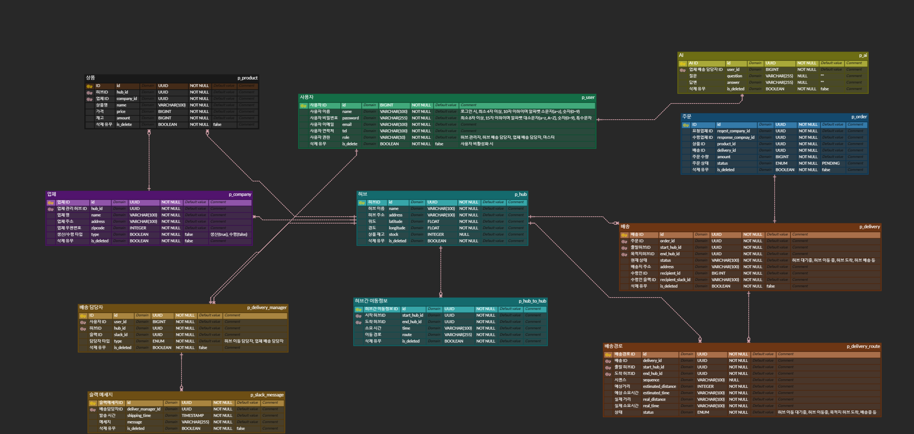

# Msa Logistics Management

## 팀원 역할분담

- **김경민 (팀장)**:
    - **담당 도메인**: 배송, 배송경로, 주문
    - **역할**:
        - 프로젝트 관리 및 조율
        - 배송 및 배송경로 시스템 개발
        - 주문 처리 로직 설계 및 구현

- **김종규 (팀원)**:
    - **담당 도메인**: 허브, 허브 간 이동정보, 업체, 상품
    - **역할**:
        - 허브 관리 및 이동 정보 처리
        - 업체와 상품 관련 시스템 개발

- **김정수 (팀원)**:
    - **담당 도메인**: 사용자, 배송 담당자, 슬랙 메시지, AI
    - **역할**:
        - 사용자 관리 시스템 개발
        - 배송 담당자 관리
        - 슬랙 메시지 기능
        - AI 기능

## 서비스 구성 및 실행방법

### 서비스 구성:
- **Delivery Service**
    - **기능**: 배송 및 배송경로 관리
    - **주요 Endpoint**:
      - `POST /delivery`: 배송 생성
      - `GET /delivery/{id}`: 배송 상세 조회
      - `GET /delivery`: 모든 배송 목록 조회 (페이징 지원)
      - `POST /deliveryroute`: 배송 경로 생성
      - `GET /deliveryroute/{id}`: 배송 경로 상세 조회

- **Order Service**
    - **기능**: 주문 관리
    - **주요 Endpoint**:
      - `POST /order`: 주문 생성
      - `GET /order/{id}`: 주문 상세 조회
      - `GET /order`: 모든 주문 목록 조회

- **Hub Service**
    - **기능**: 허브 및 허브간 이동 정보 관리
    - **주요 Endpoint**:
      - `POST /hub`: 허브 생성
      - `GET /hub/{id}`: 허브 상세 조회
      - `POST /hubRoute`: 허브간 이동 정보 생성
      - `GET /hubRoute/{id}`: 이동 정보 조회

- **Company and Product Service**
    - **기능**: 업체 및 상품 관리
    - **주요 Endpoint**:
      - `POST /company`: 업체 등록
      - `GET /company/{id}`: 업체 정보 조회
      - `POST /product`: 상품 등록
      - `GET /product/{id}`: 상품 정보 조회

- **User and Delivery Manager Service**
    - **기능**: 사용자 및 배송 담당자 관리
    - **주요 Endpoint**:
      - `POST /user`: 사용자 등록
      - `GET /user/{id}`: 사용자 정보 조회
      - `POST /deliverymanager`: 배송 담당자 등록
      - `GET /deliverymanager/{id}`: 배송 담당자 정보 조회

- **Slack Messaging and AI Service**
    - **기능**: Slack 메시지 관리 및 AI 기반 기능
    - **주요 Endpoint**:
      - `POST /slack`: 슬랙 메시지 전송
      - `POST /ai`: AI 기반 추천 시스템

### 실행 방법:
1. **프로젝트 클론**:
    ```bash
    git clone https://github.com/sparta-chapter4-project/msa-logistics-management.git
    ```

## 프로젝트 목적/상세

이 프로젝트는 물류 관리 시스템을 위한 마이크로서비스 아키텍처(MSA) 기반의 솔루션입니다. 
여러 서비스가 각각 독립적으로 관리되어 대규모 물류 환경에서의 유연성과 확장성을 제공합니다. 
주요 목적은 주문이 생성될 때, 배달과 경로 데이터를 효율적으로 관리하고, 인증 서비스로 각 사용자의 권한을 관리하는 것입니다.

## ERD



### 주요 테이블은 다음과 같습니다

- **Order**: 주문 정보
- **Delivery**: 배달 정보
- **DeliveryRoute**: 배달 경로
- **User**: 사용자 정보
- **Company, Hub, Product**: 물류 관련 정보

## 기술 스택

- Backend: Spring Boot, Java
- Database: PostgresSQL (RDS)
- Security: Spring Security, JWT
- Infra: Eureka Server, Eureka Client, Docker, API Gateway

## 트러블 슈팅/ 개선 사항
### 김경민
- 비즈니스 로직에서 권한 체크

    - **기존 방식**

        현재 시스템에서는 각 서비스마다 Spring Security를 설치하고, **@PreAuthorize** 어노테이션을 활용하여 권한을 검증하는 방식으로 유저 권한을 체크하고 있습니다. 이 방식은 코드의 가독성을 높이고, 권한 관리가 간단해 보이는 장점이 있습니다.

    - **기존 방식의 문제점**

        **@PreAuthorize** 어노테이션을 적용하려면 Spring Security 설정이 필수적입니다. 이는 각 마이크로서비스마다 Spring Security를 설치해야 한다는 부담이 있으며, 보안 설정 및 관리가 복잡해질 수 있었습니다.

    - **개선 방식**

        Spring Security에 의존하지 않고 **HttpServletRequest** 객체를 이용하여 직접 비즈니스 로직에서 권한을 검증하는 방식으로 개선했습니다. 이 방식은 Spring Security의 설치를 생략하면서도, 요청 헤더에서 유저의 권한 정보를 직접 추출해 권한을 체크할 수 있도록 해줍니다. 이를 통해 불필요한 의존성을 줄이고, 더 가벼운 권한 관리 체계를 구현할 수 있었습니다.

### 김종규
- Custom Annotion 도입 
    - **기존 방식**: RequestParam을 통해 매개 변수를 하나씩 정의
    - 
    - **개선 방식** : Custome Annotation을 활용해 RequestParam을 하나의 객체로 받음
    - 

### 김정수
- **기상청 api secret key**
  - **문제 발생**: 기상청 api의 secret key가 유효하지 않은 문제
  - **문제 해결**: 해당 secret key를 urlEncoder를 사용하여 encoding도 해봤지만 해결이 되지 않았습니다. 그러나 키를 재발급 받고 30분정도 기다리니 해결이 되었습니다.
- **기상청 api 위도, 경도**
  - **문제 발생**: 날씨 데이터를 가져오기위해 허브의 위도, 경도 값을 넣었을때 날씨 데이터가 비정상적으로 출력되는 문제
  - **문제 해결**: 위도, 경도 값을 격자 변환 공식을 사용하여 격자 자로 변경하여 해결하였습니다.

## 회고
### 김경민
- 배운 점: JWT와 Spring Security를 결합하여 MSA 환경에서 인증을 어떻게 효율적으로 관리할 수 있는지 배웠습니다.
- 개선할 점: 인증 관련 코드의 중복을 줄이고 좀 더 일관성 있는 인증 로직을 구성해야 할 것 같습니다.

### 김종규
- 배운 점 : MSA환경에서 각 서비스간의 데이터 통신을 하는 방법을 배웠습니다. 
- 개선할 점 : hub 간 경로 최적화를 하지 못한 부분이 아쉽습니다.

### 김정수
- 배운 점: MSA환경에서 각 서비스간의 데이터 통신을 하는 방법을 배웠고 외부 api연동하는 것에 조금 익숙해 졌습니다.
- 개선할 점: 코드 컨벤션을 잘 지켜 프로젝트의 코드 스타일이 하나로 통일되도록 개선하겠습니다.
