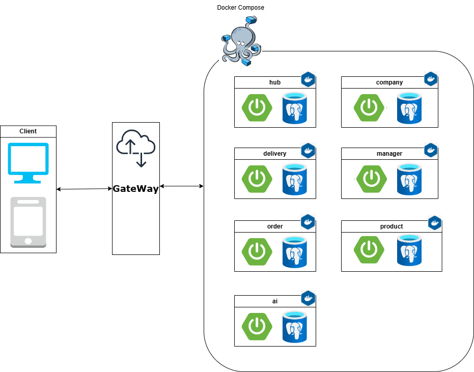

# Msa Logistics Management
## 팀원 역할분담


## 서비스 구성 및 실행방법
    - **각각의 endpoint 기재 필수**

## 프로젝트 목적/상세

## Infra



## ERD


## 기술 스택


## 트러블슈팅
### 김경민
```markdown
test
```
### 김종규
```markdown
test
```
### 김정수
```markdown
test
```

## 회고
### 김경민
```markdown
test
```
### 김종규
```markdown
test
```
### 김정수
```markdown
test
```